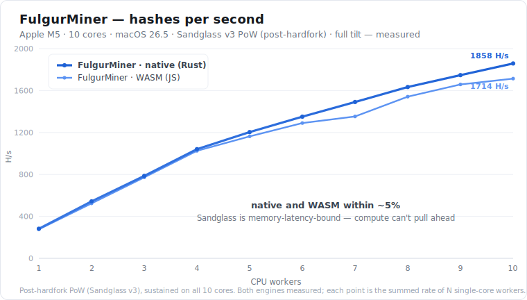

<p align="center">
  
</p>

<h1 align="center">FulgurMiner</h1>

<p align="center">
  <strong>Mine BrowserCoin from your terminal — faster than a browser tab, and out of your way.</strong>
</p>

<p align="center">
  =20.6">
  
  
  
  
  
</p>

FulgurMiner is a standalone command-line miner for [BrowserCoin](https://browsercoin.org). You bring your existing wallet address; the miner does the work and pays rewards straight to it. It never asks for a password or private key.

> [!NOTE]
> **Scripting hard-fork support — activates 2026-07-05 16:00 UTC.** This version carries BrowserCoin's scripting hard-fork consensus rules, so it follows the chain correctly both before and after the upgrade. **Solo** miners should be on **0.2.0 or later** to cross the activation cleanly (older solo versions stop following the chain at that point); **pool** miners are unaffected.

---

## Why FulgurMiner

- **It's not a browser tab.** It runs headless in your terminal — no open window, no foreground requirement. Run it on a server, or just leave it going in the background.
- **It never gets throttled.** FulgurMiner runs the *same* proof-of-work as the browser miner, but **headless** and across **every CPU core at full power**. A browser tab is just as fast per core *while you're looking at it* — but the moment you switch tabs or apps, the browser parks it on efficiency cores and it drops to a fraction of the speed (measured **280 → 49 H/s per core** on an Apple M5 once the tab is backgrounded). FulgurMiner runs in the background, on servers, across all cores, and **never slows down**. See the graph below.
- **It tunes itself.** **Smart mode** finds the highest throttle your machine sustains on its own. The **Considerate** profile goes further — it adapts to whatever else you're doing: when your other apps need the CPU it eases off, when they go quiet it ramps back up, mining just the spare capacity. Set it once and forget it.
- **macOS and Windows.** Developed and tested on macOS. **Windows is experimental** — it should work, but it hasn't been tested on a Windows machine yet, so feedback is very welcome.

### Performance

At **block 33,550** BrowserCoin switches its proof-of-work from Argon2id to **Sandglass v3** — a memory-*latency*-bound hash (a long serial pointer-chase through a small buffer). On the old Argon2id PoW the native Rust core ran ~1.9× the WASM engine; on Sandglass that edge disappears, because the work is spent *waiting on memory*, not computing — so **the native Rust core and the portable WASM engine land within ~5% of each other.** Measured on an **Apple M5 (10 cores)** at full tilt:

<p align="center">
  
</p>

Both engines peak near **1,700–1,860 H/s** across all cores. A **browser tab runs the same JavaScript on the same engine**, so — *while it's the focused tab* — it matches this per core (~**280 H/s**). But switch away and the browser parks that tab on efficiency cores: **~49 H/s per core, ~5.7× slower** (measured). FulgurMiner is headless, so it never gets backgrounded — it holds full performance-core speed on every core, on any machine.

---

# Getting started

The easy path: install, run, and pick your settings from a menu. No config files, no flags.

## 1. Install

**First, for everyone: install [Node.js](https://nodejs.org) 20.6 or newer** (the LTS installer is fine; check with `node --version`). Then pick the path that fits you.

### A · Quick start (if you're comfortable with a terminal)

```bash
git clone https://github.com/alpenmilch411/FulgurMiner.git   # or grab the ZIP: Code → Download ZIP
cd FulgurMiner
npm install
npm start
```

No compilers, no system libraries — that's the whole setup for the default engine. *(The optional, faster **native** engine needs Rust — see [Native engine](#native-engine). Not required.)*

> **Windows (PowerShell):** if `npm` is blocked with *"running scripts is disabled on this system,"* either use **Command Prompt (cmd)** instead, or run once: `Set-ExecutionPolicy -Scope CurrentUser RemoteSigned` (or `-Scope Process` for just this terminal). An `npm warn allow-scripts … esbuild …` notice is **harmless** — the install still completes.

### B · Step-by-step (new to this — no terminal experience needed)

This is the **Windows** walkthrough; macOS/Linux is the same idea (open Terminal in the folder — no execution-policy step needed).

1. **Install Node.js** from [nodejs.org](https://nodejs.org) (the big green **LTS** button).
2. **Download FulgurMiner:** on the [repo page](https://github.com/alpenmilch411/FulgurMiner) click **Code → Download ZIP**, then unpack the folder (e.g. onto your Desktop). *(No git needed.)*
3. Open that folder and **right-click an empty space → "Open in Terminal."**
4. *(Windows PowerShell only)* type this and press Enter: `Set-ExecutionPolicy -Scope CurrentUser RemoteSigned`
5. Type `npm install` and press Enter.
6. Type `npm start` and press Enter. The miner opens — paste your **wallet address**, choose your settings, highlight **Start mining** and press Enter. It runs the portable **wasm** engine.

**Optional — build the "native" (Rust) engine** *(optional: a real speedup on the old Argon2id PoW; on Sandglass v3 it's within ~5% of the default engine — see [Performance](#performance))***:**

7. Install **Rust** from [rustup.rs](https://rustup.rs): download and run `rustup-init.exe`, type **1** and press Enter. It installs the **Visual Studio build tools** (accept that), then finishes Rust. *(macOS: if the build later complains about a missing linker, run `xcode-select --install`.)*
8. **Close the terminal and open a new one** in the FulgurMiner folder. **This step matters** — only a freshly opened terminal sees Rust on your PATH.
9. Run `npm start` again, set **Engine → native**, and **Start mining**. When it asks *"build the native engine now?"*, type **Y**. After a one-time build (~a minute), it mines with the faster engine.

## 2. Start

```bash
npm start
```

In a normal terminal this opens a **two-pane arrow-key menu** — your settings on the left, a plain-language explanation of whatever you've highlighted on the right:

```
┌─ FulgurMiner ──────────────────────┐ ┌─ About ────────────────────────────┐
│   Start mining                     │ │ Manual lets you set the duty cycle │
│   Wallet         a1b2…9f0e         │ │ by hand; Smart auto-tunes it for   │
│   Where to mine  FulgurPool · ful… │ │ you. Press Enter to choose.        │
│   Workers        auto (9)          │ │                                    │
│ ▶ Mode           Smart: Considerate│ │                                    │
│   Throttle       (auto)            │ │                                    │
│   Engine         wasm  (portable)  │ │                                    │
│   Check for updates  on            │ │                                    │
│   Help / How it works              │ │                                    │
│   Quit                             │ │                                    │
└────────────────────────────────────┘ └────────────────────────────────────┘
  ↑/↓ move · ←/→ change · Enter select · ? help · q quit
```

Use **↑/↓** to move and **Enter** to select. On a value row, **←/→** cycles the choices; **Where to mine** and **Mode** open their own picker with **Enter**. Press **?** any time for an in-app manual, **q** to quit.

The first time, set your **Wallet** (paste your address — see below), then highlight **Start mining** and press **Enter**. Your settings are remembered, so next time you can just start. On a narrow terminal the menu folds into a single column with the explanation inline.

By default FulgurMiner mines to **[FulgurPool](https://fulgurpool.xyz)**, the project's own pool — just set your wallet and start. The **Where to mine** picker includes **FulgurPool**, **Solo**, and a built-in **brcpool**. Custom pools can be added or removed directly inside the picker (in both `npm start` and `npm run settings`), or by editing `pools.json` for advanced users. Pool URLs can be written with or without the `https://` scheme; a malformed entry is shown in the picker so you can fix it.

## 3. Pick a Mining mode

The **Mode** row chooses how hard FulgurMiner pushes your CPU:

- **Manual** — you set Workers and Throttle by hand. This is the classic behaviour.
- **Smart: Max** — FulgurMiner auto-tunes the throttle to the highest your machine can sustain. On a well-cooled machine this is about the same as running at 100% by hand — the win is that it *finds* that point for you and adapts as the machine heats up or cools down.
- **Smart: Considerate** *(best for a machine you're using)* — auto-tunes like Max, but adapts to what the rest of your machine is doing. When your other apps need the CPU it eases off; when they go quiet it ramps back up. You mine the spare capacity the rest of the time, without a hot, sluggish laptop.

When a Smart mode is on, the **Throttle** row shows `(auto)` — the miner owns it. Switch **Mode** back to **Manual** to set the throttle yourself.

## Your wallet

Open the BrowserCoin app, go to **Wallet**, and click **Copy** under *"Your address"*. It's a 64-character string of letters and numbers (0–9, a–f). Paste that into FulgurMiner when asked. Rewards are paid straight to it.

> You only ever share your **address** — it's public, like an email address. FulgurMiner never needs your private key, and you should never paste a private key anywhere.

## Running on multiple machines

You can run FulgurMiner on as many machines as you like, **all set to the same wallet address** — there's nothing to configure beyond pasting the same address on each. In pool mode every machine registers as its own worker and the pool credits all of their shares to that one address, so your hashrate and earnings simply add up. (Solo works the same way — each machine mines independently to the address.)

## The dashboard

Once mining, FulgurMiner shows a live, framed dashboard:

```
┌──────────────────────────────────────────────────────────────────────┐
│ FulgurMiner  ·  terminal miner for BrowserCoin                         │
├──────────────────────────────────────────────────────────────────────┤
│ ● MINING   FulgurPool · fulgurpool.xyz   wasm · 8 cores       14:32:07 │
│ auto throttle 84% Considerate · easing off (leaving CPU for your work) │
├──────────────────────────────────────────────────────────────────────┤
│ HASHRATE                          SESSION                              │
│ now  3.30k H/s                    up   12m 41s                         │
│ avg  3.11k H/s                    shrs 142 (139 ok)                    │
│ peak 3.42k H/s                    work 2.21M                           │
│ ▂▃▅▆▇█▇▆▅▄▅▆▇█▇▆▅▄▃▂▃▅▆▇█         hgt  11,772 diff 1e02b4ec            │
├──────────────────────────────────────────────────────────────────────┤
│ EVENTS                                                                 │
│   14:32:01 synced to height 11,772                                     │
│   14:32:05 share accepted: ok                                          │
├──────────────────────────────────────────────────────────────────────┤
│ q quit · s settings · u update · ? help                               │
└──────────────────────────────────────────────────────────────────────┘
```

- **Status bar** — a coloured `●` dot and state word: amber **SYNCING** while it downloads and verifies the chain, green **MINING** once it's working, red on an error. Then your mining target and the pool's host (clickable where terminals support links), the engine, core count, and a clock.
- **auto throttle** *(Smart mode only)* — the live duty cycle the controller settled on, and the mode. In Considerate it shows *easing off* whenever it's holding back to leave the machine free for you.
- **HASHRATE** — current (`now`), session-average (`avg`), and best (`peak`) hash rate, plus a **sparkline** of recent rate so you can watch it ramp and settle.
- **SESSION** — uptime, found blocks / accepted shares, total work, chain height, and difficulty.
- **Earnings & Jackpot** — on FulgurPool, your balance (earned / pending / paid) and the **3%** finder bonus with your block strikes; in solo, an estimate from blocks you've found. A block strike (a share that solved a whole block) is worth at least **50 BRC**; the jackpot credit appears after the block matures (~25 min).
- **EVENTS** — recent syncs, finds, shares, and warnings.

**Keys:** **q** quits, **s** returns to the menu (settings), **u** shows the exact update command when one is available, **?** opens the manual. Change anything in the menu and choose **Start mining** again to apply it live — no restart. On narrow or short windows the dashboard switches to a compact, frame-free layout so it never overflows.

---

# Advanced

Everything below is optional. FulgurMiner works out of the box with the menu above.

## Running without the TUI

For servers, scripts, or any non-interactive setup, run the plain-log miner:

```bash
npm run mine                 # plain logs, reads .env.local / env vars
npm start -- --no-tui        # launcher without the dashboard
FULGUR_TUI=0 npm start       # same, via env var
```

Plain mode prints clean, greppable lines — no ANSI, no full-screen redraw. A **default run mines on FulgurPool** (the pool serves the work, so there's no chain to download):

```
[pool-miner] connecting to FulgurPool…
[pool-miner] registered worker 2e63e420-1557-4d3a-beae-…
[pool-miner] 3284 H/s auto 84% (easing off)
[pool-miner] share accepted: accepted
[pool-miner] earnings: 1.5 BRC (pending 0.5, paid 1)
[pool-miner] jackpot: 3% finder bonus - your strikes: 0
```

**Solo mode** (`MINER_POOL=solo`) downloads and verifies the chain, then mines full blocks locally:

```
[minerd] verifying BrowserCoin blockchain 9,200 / 11,772 (78%)
[minerd] synced to height 11,772
[minerd] mining to a1b2c3d4e5f60718… (8 workers, throttle 0.75)
[minerd] h=11772 diff=1e02b4ec hps:3284
```

Later solo runs restore the verified chain from a local save and only catch up new blocks. When stdout isn't a terminal (a pipe, a log file, CI), FulgurMiner uses plain mode automatically. There's no arrow menu in plain mode; change settings with `npm run settings`.

## Settings & environment variables

Every option is an environment variable or a line in `.env.local` (written for you — never commit it). See `.env.example` for a template. The menu and `npm run settings` are just front-ends over these.

| Variable | Default | Meaning |
| --- | --- | --- |
| `MINER_PUBKEY` | *(required)* | Your wallet address (64 hex chars). Rewards go here. |
| `MINER_POOL` | FulgurPool | `solo` to mine alone, or a pool URL. Unset/blank follows the default pool (FulgurPool). |
| `MINER_SMART` | `off` | `off` (Manual) · `max` · `considerate`. When set, the mode picks the rate and `MINER_THROTTLE` is not used: Max goes straight to 100% and holds; Considerate starts at 50% and floats with your CPU load. |
| `MINER_WORKERS` | cores − 1 | CPU worker threads. Auto (unset) leaves one core free; inside a CPU-limited container it uses the whole allowance instead of the host's core count. Set it by hand to override. |
| `MINER_THROTTLE` | `0.75` | Duty cycle (`0.05`–`1.0`): fraction of wall-time spent hashing. Lower = cooler & quieter. Ignored when a Smart mode is on (the mode sets the rate). Any value in the range can be set from the Throttle picker's Custom option, not just the presets. |
| `MINER_NATIVE` | *(off)* | `1` uses the native Rust engine (built on demand if missing and Rust is installed). |
| `MINER_CUDA` | *(off)* | `1` uses the opt-in CUDA engine when `cuda-poc/brc-argon-cuda-helper` is built and the NVIDIA runtime is available; otherwise falls back to WASM. |
| `MINER_CUDA_BATCH` | *(auto)* | Optional CUDA batch cap. Unset/`0` selects the largest batch that fits the detected VRAM budget; each nonce reserves about 32 MiB of VRAM. |
| `MINER_CUDA_DEVICE` | `0` | CUDA device index. Use `./cuda-poc/brc-argon-cuda-helper --info` (or set this variable first) to verify the selected card. |
| `MINER_CUDA_VRAM_MAX_MIB` | *(unset)* | Optional total VRAM usage budget. The helper stays below this amount after accounting for other GPU users. |
| `MINER_CUDA_VRAM_RESERVE_MIB` | `1024` | VRAM kept free for Windows/WSL/display/other CUDA workloads when selecting the batch. |
| `MINER_CUDA_VRAM_GUARD_MIB` | `2048` | Additional allowance for CUDA driver/context allocation overhead; protects the reserve from optimistic `cudaMalloc` estimates. |
| `MINER_CUDA_PERSISTENT` | `0` | Enables the opt-in persistent CUDA kernel, which processes multiple nonce batches per launch. |
| `MINER_CUDA_PERSISTENT_ITERATIONS` | `8` | Batches processed per persistent launch; larger values improve launch amortization but delay job updates. |
| `MINER_HELPERS` | `api1`/`api2.browsercoin.org` | Comma-separated API helper URLs for chain sync / solo mining. Each read tries them in turn and takes the first that answers, so one dead helper doesn't stop the miner tracking the tip. A helper that keeps failing gets demoted so reads stop leading with it; you get a warning when *every* helper fails a round. A blank or comma-only value falls back to the defaults. |
| `MINER_DEBUG` | *(off)* | `MINER_DEBUG=1` adds debug lines — the per-helper read failures the miner recovered from on its own, plus snapshot notes. Env var only (`npm run mine` doesn't read `.env.local`). |
| `MINER_LOG_FILE` | *(off)* | Optional append-only JSONL sidecar path. Console output remains enabled; structured events include hashrate, CUDA jobs/batches, shares, slot exhaustion, earnings, and blocks. |
| `MINER_LOG_DIR` | *(off)* | Optional directory for one new timestamped JSONL event file per miner start. Created automatically; `MINER_LOG_FILE` takes precedence. |
| `FULGUR_TUI` | *(auto)* | `0` forces plain logs; otherwise the TUI is used when stdout is a terminal. |
| `FULGUR_NO_UPDATE_CHECK` | *(off)* | `1` disables the best-effort startup update check. |
| `JOB_POLL_MS` | `1000` | Pool mode only: fallback polling interval (ms). When the pool supports long-poll, new work arrives instantly; otherwise the miner polls `/job` at this cadence. Clamped to `250`–`60000`. |
| `JOB_WAIT_S` | `25` | Pool mode only: `/job` long-poll hold seconds — picks up new work instantly when the pool publishes it; falls back to `JOB_POLL_MS` fast-poll against pools that don't support it. Range `0`–`30`; `0` disables long-poll. |

```bash
# Solo-mine
MINER_PUBKEY=<your-address> MINER_POOL=solo npm run mine

# CUDA solo mining
MINER_PUBKEY=<your-address> MINER_POOL=solo MINER_CUDA=1 npm run mine

# Considerate smart mode, native engine
MINER_PUBKEY=<your-address> MINER_SMART=considerate MINER_NATIVE=1 npm run mine

# Mine at a specific pool
MINER_PUBKEY=<your-address> MINER_POOL=https://pool.example.org npm run mine

# Keep console output and write structured events to a JSONL sidecar
MINER_LOG_FILE=miner-events.jsonl npm run mine

# Create a separate timestamped file for this miner session
MINER_LOG_DIR=logs npm run mine

# Safe smoke test — syncs the chain, checks everything agrees, submits nothing
MINER_PUBKEY=<your-address> npm run mine:dryrun
```

## Local observability

The miner can write structured JSONL events alongside its normal console output.
Use `MINER_LOG_DIR=logs` to create one timestamped file per miner process, or
`MINER_LOG_FILE=path.jsonl` to append to a specific file. The directory form is
recommended when running CPU and CUDA miners together because each session gets
its own file and machine identity.

For local graphs and event inspection, the repository includes a
Vector → ClickHouse → Grafana stack. See the complete setup and troubleshooting
instructions in [`observability/README.md`](observability/README.md).

The update check is quiet and best-effort: it reads the latest version from the project's [GitHub releases](https://github.com/alpenmilch411/FulgurMiner/releases) (plus the pool's notice / required-version signal) and fails silently offline. Turn the check off with **Check for updates → off** or `FULGUR_NO_UPDATE_CHECK=1`. FulgurMiner never runs an update for you.

**To update:**

```bash
npm run update     # = git pull --autostash && npm install
npm start
```

(If you installed from the ZIP instead of cloning: download the latest ZIP and run `npm install` again.)

> **Why `--autostash`?** Running `npm install` can modify `package-lock.json` on your machine — some of the build tooling ships different packages per operating system, so the file legitimately differs on Windows, Linux and macOS. That counts as a local change, so a plain `git pull` stops with *"Your local changes to the following files would be overwritten by merge: package-lock.json"*. `--autostash` sets that change aside, pulls, and puts it back. Nothing of yours is lost, and your settings (`.env.local`, `pools.json`) are never touched either way.

## Native engine

By default FulgurMiner uses a portable **wasm** engine that runs anywhere Node runs — zero setup. The **native** (Rust) engine was ~1.9× faster on the old Argon2id PoW; on **Sandglass v3** (the new PoW from block 33,550) the two are within ~5% (see [Performance](#performance)), so native is now an optional alternative rather than a meaningful speedup. Switch via the **Engine** setting (or `MINER_NATIVE=1`). On the next start FulgurMiner:

- uses the built engine if it's already there;
- offers to **build it now** (a one-time `cargo build --release`, ~a minute) if you have the [Rust toolchain](https://rustup.rs);
- otherwise prints the build command and keeps mining with wasm — nothing blocks.

**Getting Rust (one-time).** Install it from **[rustup.rs](https://rustup.rs)**, then **open a new terminal** so `cargo` is on your PATH before building. The build also needs a C toolchain:

- **Windows** — when you run `rustup-init.exe` it offers to install the **MSVC build tools** (via the Visual Studio Installer); accept that. Then reopen the terminal in the FulgurMiner folder.
- **macOS** — if the build reports a missing linker, install the Command Line Tools: `xcode-select --install`.
- **Linux** — install a build toolchain, e.g. `build-essential` (Debian/Ubuntu).

```bash
cd native/brc-pow && cargo build --release && cd ../..
MINER_NATIVE=1 npm start
```

## CUDA engine (experimental)

The CUDA engine reuses FulgurMiner's existing mining coordination and
block/share submission paths. It can mine pool jobs or search the full nonce
range for solo block templates.

### CUDA quick setup (Linux)

You need a CUDA-capable NVIDIA GPU and driver, Node.js 20.6+, Git, Make, a C++
compiler, and the **CUDA 12.8 Toolkit**. First check that the driver can see the
GPU:

```bash
nvidia-smi
```

Add NVIDIA's CUDA package repository for your exact distribution and release
using the commands from the [CUDA 12.8 download
archive](https://developer.nvidia.com/cuda-12-8-0-download-archive?target_os=Linux).
Choose **Linux**, your architecture and distribution, then **deb (network)** or
**rpm (network)**. After running the repository setup shown there, install the
pinned toolkit and normal build tools:

```bash
# Ubuntu / Debian
sudo apt update
sudo apt install build-essential cuda-toolkit-12-8

# Fedora (run these instead)
sudo dnf install make gcc-c++ cuda-toolkit-12-8
```

CUDA 12.8 may reject the newer GCC shipped by some Fedora releases. If it does,
install the GCC compatibility package recommended by NVIDIA's [CUDA 12.8 Linux
guide](https://docs.nvidia.com/cuda/archive/12.8.0/cuda-installation-guide-linux/#gcc-compatibility-package-for-fedora)
and set `NVCC_CCBIN` as shown there (for example, `g++-13` on Fedora 41).

On Debian/Ubuntu, do not rely on the distro's unversioned
`nvidia-cuda-toolkit` package: this build defaults to NVIDIA's versioned compiler at
`/usr/local/cuda-12.8/bin/nvcc`. Confirm the toolchain, install the Node
dependencies, build the helper, and run its validation:

```bash
/usr/local/cuda-12.8/bin/nvcc --version
npm install
make -C cuda-poc cuda-helper
make -C cuda-poc cuda-check
./cuda-poc/brc-argon-cuda-helper --info
```

The default build target is `sm_120`, validated on an RTX 5080. For another
GPU, find its [CUDA compute
capability](https://developer.nvidia.com/cuda-gpus), remove the decimal point,
and override the target when building (for example,
`make -C cuda-poc cuda-helper CUDA_ARCH=sm_89` for capability 8.9). Other GPU
architectures are currently experimental.

From the repository root, start the configured CUDA solo miner with:

```bash
MINER_CUDA=1 MINER_CUDA_DEVICE=0 \
  MINER_CUDA_VRAM_RESERVE_MIB=2048 MINER_CUDA_BATCH=400 \
  MINER_SMART=off MINER_THROTTLE=1 \
  MINER_CUDA_PERSISTENT=1 MINER_CUDA_PERSISTENT_ITERATIONS=16 \
  MINER_LOG_DIR=logs \
  MINER_PUBKEY=aa507295d44c9338c1f9698ccd55cf8aaf217e14c91cb28ae735381fa46283a7 \
  MINER_POOL=solo npm run mine
```

`MINER_CUDA_BATCH=400` is a cap for a high-VRAM card, not a guaranteed
allocation; the helper lowers it when necessary to preserve the configured
VRAM reserve and its allocation guard.

CUDA is opt-in. If the helper is missing or cannot initialize the NVIDIA
runtime, the miner reports the reason and uses the portable WASM engine. The
CUDA helper honors either the pool-assigned nonce slot or solo's full nonce
range and does not implement a separate pool protocol. `MINER_CUDA_BATCH=32` is an example that limits the
working set to roughly 1 GiB. `MINER_WORKERS` controls CPU workers and does not
create additional CUDA contexts; the CUDA path uses one helper and one active
batch at a time.

Solo CUDA mining submits only complete blocks, not shares. Its expected block
finding rate is the same as any other miner at the same hashrate, so long
periods without a block are normal even when the local CUDA hashrate is high.

The status bar shows `cuda`, `native`, or `wasm` so you can confirm which is active. If CUDA or native was selected but isn't usable, the dashboard says why and keeps mining with wasm.

## Troubleshooting

- **The first sync takes a moment.** A fresh solo start downloads and verifies BrowserCoin's chain so you build on the right one. The `Verifying blockchain` bar (TUI) / `verifying … (P%)` lines (plain) show progress — it's working, not stuck. (Pool mining skips this; the pool serves the work.)
- **Restarts are fast.** After the first sync the verified chain is saved in `~/.fulgurminer/`; the next launch resumes and fetches only new blocks. The save is rebuilt if missing or stale, so deleting `~/.fulgurminer/` is safe.
- **"MINER_PUBKEY is required" / "address must be 32 bytes."** Your wallet must be exactly 64 hex characters — re-copy it from the app (**Wallet → Copy**).
- **`npm start` errors about the Node version.** You need Node 20.6+. Check `node --version`.
- **Fans spin up / the laptop gets hot.** Use **Smart: Considerate**, or in Manual lower the **Throttle** (e.g. `0.4`) or reduce **Workers**.
- **The pool says syncing / busy.** Leave it running — the miner retries with backoff and resumes when the pool is ready. After a couple of minutes it reminds you that **s → Where to mine → Solo** is available if you'd rather switch.
- **Windows: hashrate drops when the window isn't focused.** Windows power-throttles background apps to save energy. Set **Power mode** to *Best Performance* (Settings → System → Power & battery), plug in a laptop, or just keep the miner window in the foreground.
- **Windows: a "Windows protected your PC" (SmartScreen) prompt** for the native engine. The `brc-pow` binary you build locally is unsigned. It's the engine you just compiled — choose *More info → Run anyway*, or stick with the wasm engine.
- **Windows: the menu looks garbled.** Use **Windows Terminal** or **PowerShell 7** (the arrow-key dashboard needs modern ANSI support), or run plain mode with `npm start -- --no-tui`.
- **Windows: the dashboard won't draw on an older console.** Some legacy consoles can't sustain the full-screen dashboard. The miner now detects this and automatically switches to **plain text mode** for the rest of the run, so it keeps mining instead of stopping. If even plain output can't reach your console, the miner keeps grinding and submitting shares in the background regardless — your earnings are unaffected and visible on the pool page. To skip the dashboard up front, run `npm start -- --no-tui`.
- **Reconfigure from scratch.** Delete `.env.local` and run `npm start` again, or open settings (**s**, or `npm run settings`).

## How it works

FulgurMiner syncs BrowserCoin's chain from public API helpers (`MINER_HELPERS`). While mining, each tip and block read tries them in rotation and takes the first that answers, so a helper going down doesn't cost you the read — the miner recovers on the next one and keeps mining current work instead of grinding a stale template. Nothing is asked of you when that happens, so a recovered read is only logged with `MINER_DEBUG=1`; a helper that fails several rounds in a row is demoted so reads stop leading with it, and if *every* helper fails a round the miner warns. (If every helper is unreachable while catching up to a new tip, the miner pauses stale work and keeps retrying rather than building on an outdated chain.) A solo block, once found, is broadcast to *every* helper — so a dead one does show up in that line. It builds a block template that pays the coinbase to your address, and searches for a proof-of-work solution across your CPU cores (Argon2id hashing, switching to **Sandglass v3** at block 33,550). In **solo** mode it submits a full block when it finds one; in **pool** mode it submits *shares*, which the pool aggregates and splits. It's the same proof-of-work the browser app uses — just running headless, on the native core, across all your cores. The native core only *proposes* nonces; every solution is independently rebuilt and re-validated before submission, so it can never get an invalid block accepted.

---

## License

MIT
